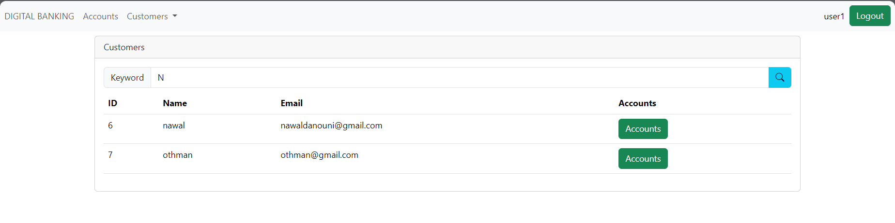

<<<<<<< HEAD
--------------------------------------------Realisé par : DANOUNI Nouhaila----------------------------------------------

Projet : Digital Banking Frontend 

Introduction
=======
----------------------------------------------------Realisé par : DANOUNI Nouhaila----------------------------------------------

<h1>Projet : Digital Banking Frontend </h1>

<h2>Introduction</h2>
>>>>>>> 4b10a2a (first commit)
The project aims to develop a web application using Angular as the front-end framework and a Spring Boot API as the backend. The focus is on managing clients, bank accounts, customer-account relationships, and includes an authentication system.

It's important to note that this readme primarily highlights the frontend part of the project, showcasing code structure, implemented features, and the robustness of the integrated security system to meet specific management needs.

<<<<<<< HEAD
Components

1. Components
=======
<h2>Components</h2>

<h3>1. Components</h3>
>>>>>>> 4b10a2a (first commit)
- Customers & New-Customer Component: Component dedicated to customer management.
- Accounts Component: Component for managing bank accounts.
- Customers-Accounts Component: Component ensuring the management of relationships between clients and accounts.
- Login Component: Authentication component allowing users to log in.
- environment.ts: Used in the Angular project to define environment variables.
- not-authorized:

<<<<<<< HEAD
2. Services
=======
<h3>2. Services</h3>
>>>>>>> 4b10a2a (first commit)
- Customers-Services: Service associated with customer management.
- Accounts-Services: Service responsible for managing bank accounts.
- Auth-Service: Authentication service ensuring application security.

<<<<<<< HEAD
3. Interceptors
- Interceptors have been created to handle outgoing and incoming HTTP requests, ensuring proper error control and management.

4. Guards
- Authentication Guard: A gatekeeper protecting routes requiring authentication.
- Authorization Guard: A gatekeeper managing access authorization to different parts of the application.

5. Route Definition
- Routes have been defined to allow smooth and intuitive navigation within the application. Routes are protected by authentication and authorization guards to ensure security. All components, services, interceptors, and guards have been thoroughly tested to ensure correct functionality and identify any undesirable behavior.

Access Page Management

- JWT_token
  

Admin Pages

- Login
  

- Adding a New Customer
  
  

- Search
  

- Deleting a Customer
  

- Operations
  Credit
  
  
  Debit
  
  
  Transfer
=======
<h3>3. Interceptors</h3>
- Interceptors have been created to handle outgoing and incoming HTTP requests, ensuring proper error control and management.

<h3>4. Guards</h3>
- Authentication Guard: A gatekeeper protecting routes requiring authentication.
- Authorization Guard: A gatekeeper managing access authorization to different parts of the application.

<h3>5. Route Definition</h3>
- Routes have been defined to allow smooth and intuitive navigation within the application. Routes are protected by authentication and authorization guards to ensure security. All components, services, interceptors, and guards have been thoroughly tested to ensure correct functionality and identify any undesirable behavior.

<h2>Access Page Management</h2>

<h3>- JWT_token</h3>
  

<h2>Admin Pages</h2>

<h3>- Login</h3>
  

<h3>- Adding a New Customer</h3>
  
  

<h3>- Search</h3>
  

<h3>- Deleting a Customer</h3>
  

<h3>- Operations</h3>
<h4> Credit </h4>
  
  
<h4>  Debit</h4>
  
  
<h4>  Transfer </h4>
>>>>>>> 4b10a2a (first commit)
  
  

<<<<<<< HEAD
User Pages

- Login
  

- Search
  

- Search for an Account
  

Conclusion
=======
<h2>User Pages</h2>

<h3>- Login</h3>
  

<h3>- Search</h3>
  

<h3>- Search for an Account</h3>
  

<h2>Conclusion</h2>
>>>>>>> 4b10a2a (first commit)
In conclusion, this project has successfully delivered a robust and secure frontend application that effectively meets the requirements of banking management. The clear code structure, successful implementation of features, and integration of an exemplary security system attest to the quality of the design. This work marks a significant step in providing a comprehensive and reliable solution for the banking sector.
